# Comparação entre os modelos
## Comparação Visual
### Metodologia
Utilizamos o three.js para visualizar e comparar visualmente o modelo original e o modelo otimizado

[Modelo original](https://drive.google.com/file/d/1y0RO4UL7ATqx3Q4zvvw2nYTK0711Ezot/view?usp=drive_link)

[Modelo otimizado](../modelos/mouse-otimizado.glb)

## Parte frontal
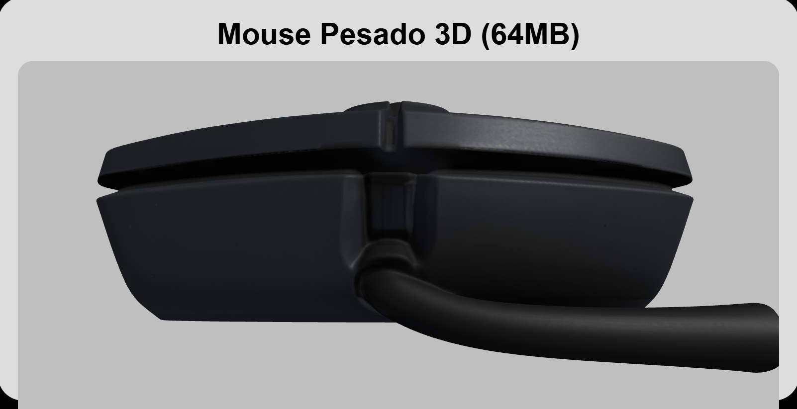
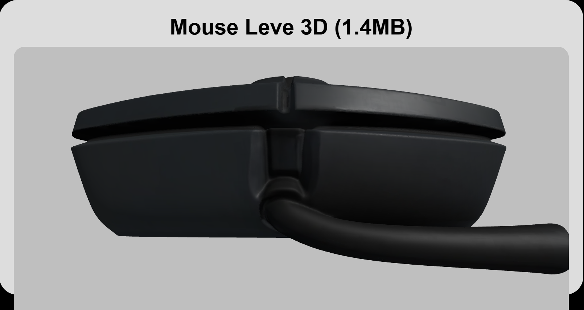

## Parte frontal superior
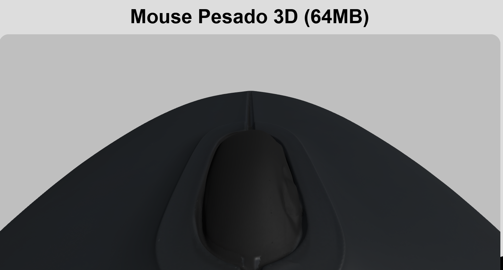
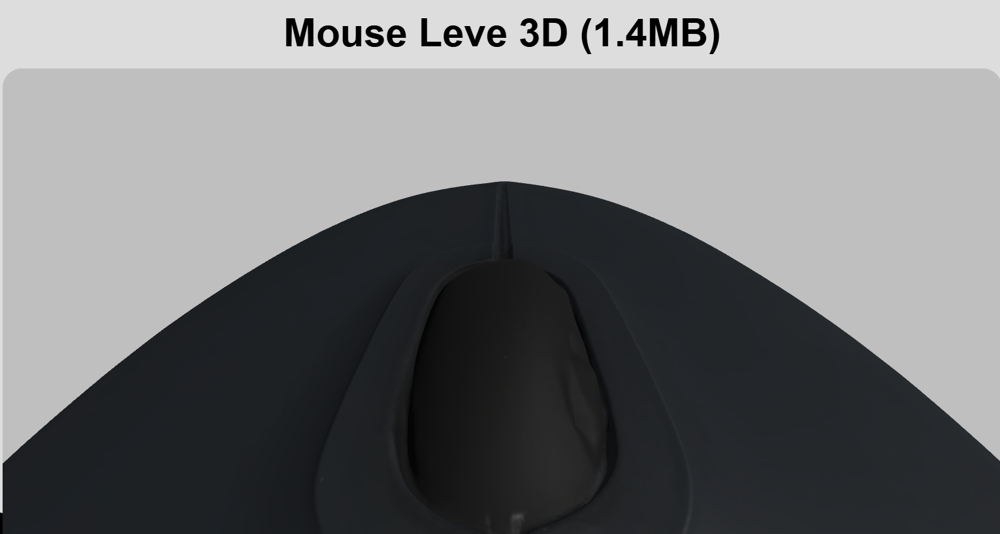

## Parte lateral
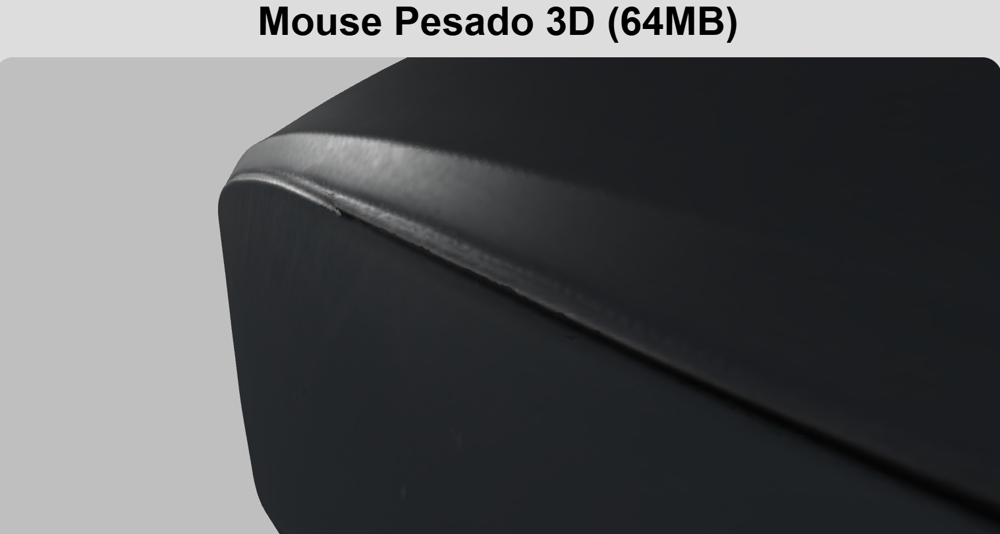
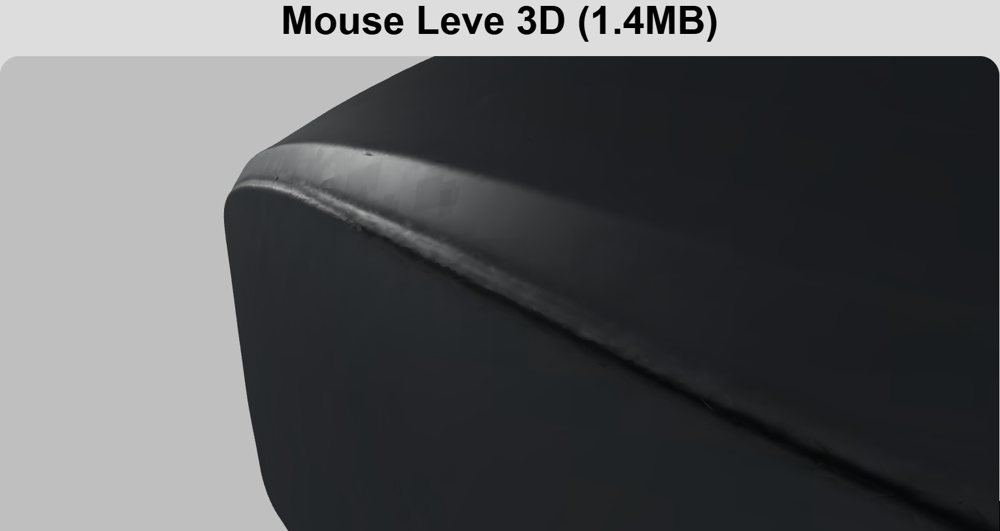

## Parte superior
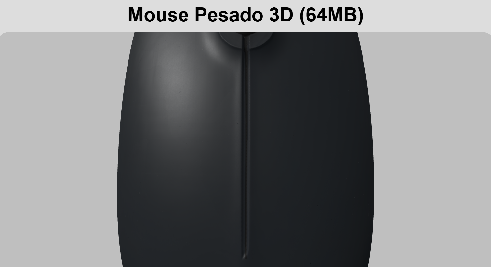
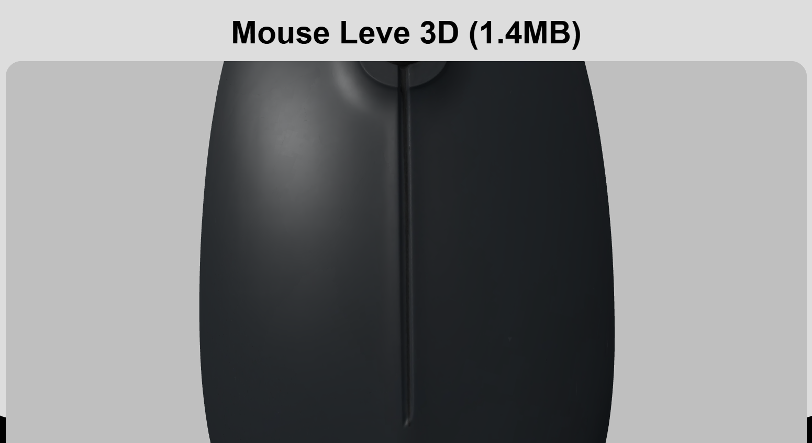

## Parte diagonal
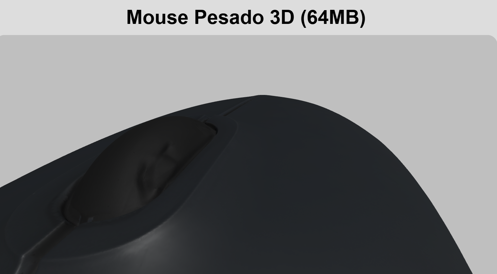

## Comparação dos Polígonos

- Mouse Pesado 3D (64MB)

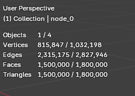
- Mouse Leve 3D (1.4MB)

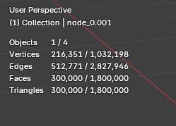
