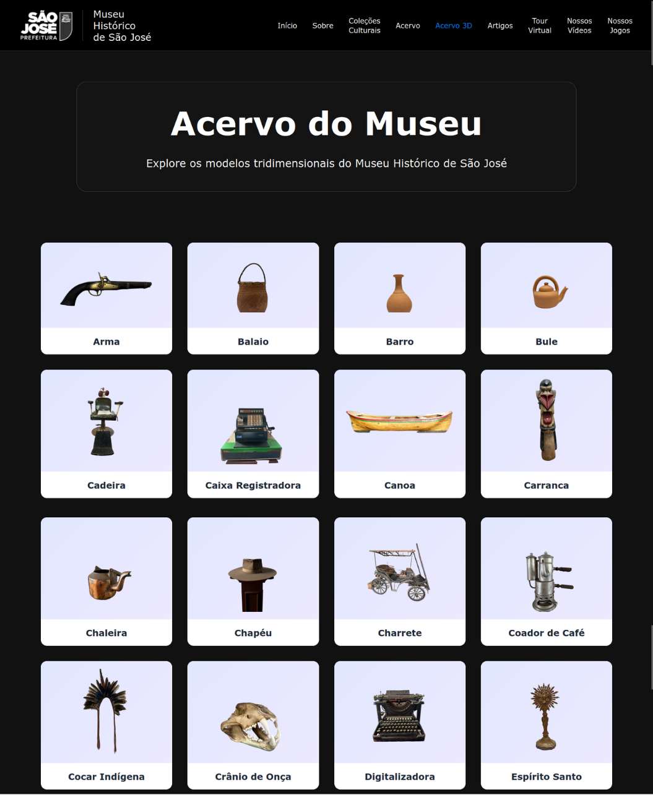
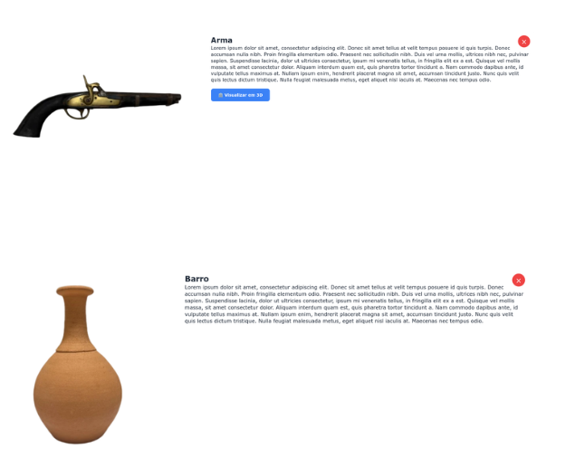

# Sprint 4 - Estilização página inicial e Exibição condicional do botão do 3D


## Objetivos
- Tornar a página de modelos 3D mais bonita
- Mostrar o botão de visualização 3D na página do acervo apenas para os itens que possuem um arquivo 3D


## Página de modelos 3D mais bonita
Alteramos o HTML e CSS para fazer com que a página se torne similar em relação as outras do site, utilizando as mesmas cores e elementos


Depois:


## Exibição condicional do botão do 3D
Resolvemos o problema de aparecer o botão de Visualizar em 3D para todos os itens do acervo. Agora o botão Visualizar em 3D é exibido apenas se existir um modelo 3D daquele item, caso não tenha não é mostrado nenhum botão.



### Código do botão
```
if (item.url) {
        activate3dBtn.style.display = 'block'; 
        preloadModel(item.url);
    } else {
        activate3dBtn.style.display = 'none'; 
    }
```