# Tutorial de otimização dos modelos 3D

## 1 - Pegue o arquivo do modelo 3D e arraste para dentro do Blender

## 2 - Ativar as estatísticas do modelo, siga os prints a seguir:

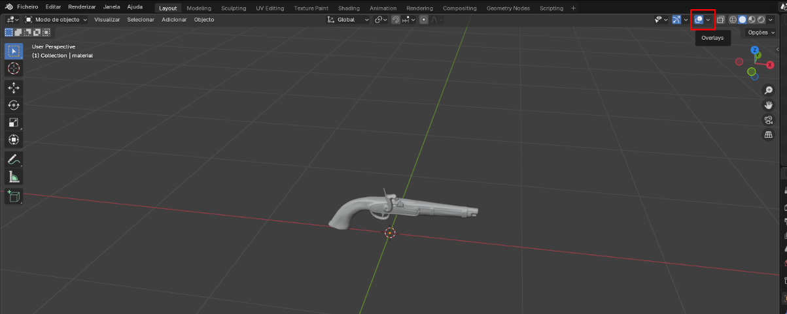

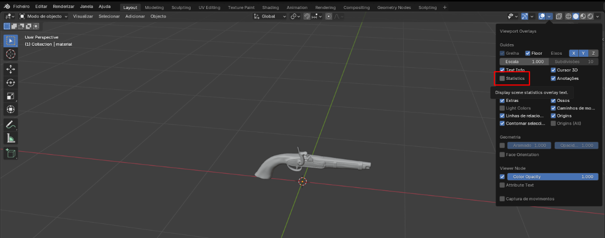

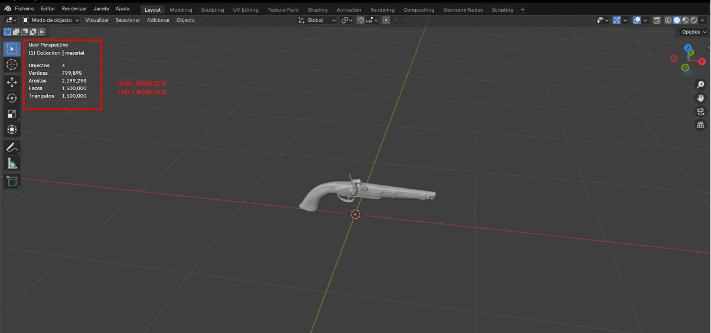

## 3 - Aplicar modificadores, siga os procedimentos a seguir:

### *Em caso de querer diminuir o tamanho do modelo no Blender, use a tecla “s” ou ative o modo de escalonamento no lado esquerdo da tela, mas CUIDADO para não deixar muito pequeno, pois pode gerar bugs.*

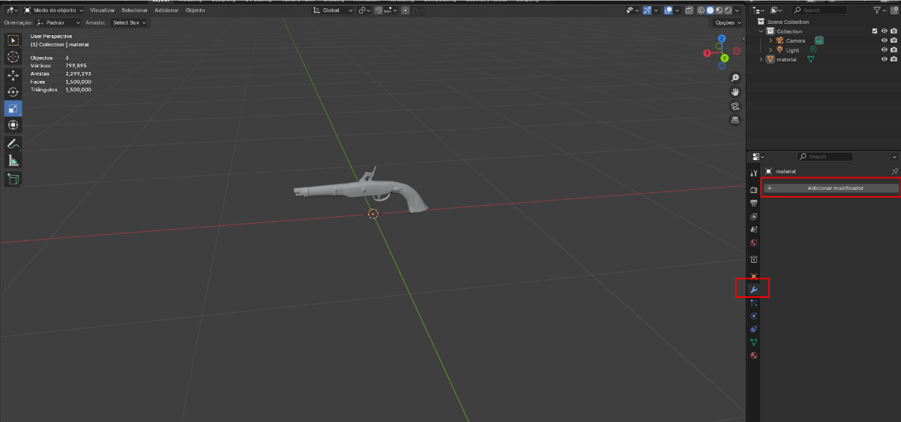

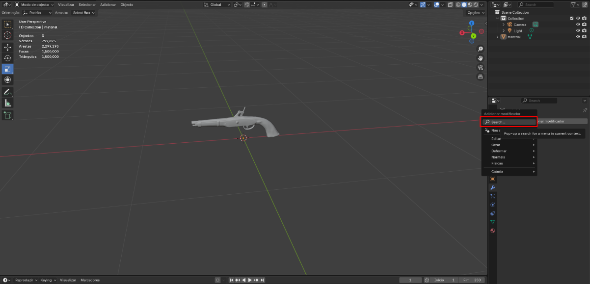

### *Nessa lupa de busca acima, escreva “decimate” ou “decimar”*

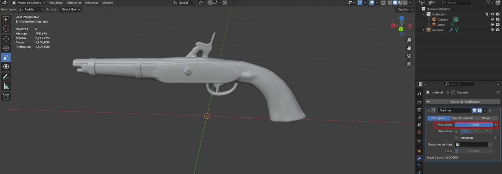

## IMPORTANTE!

### Nesse passo é necessário analisar o número das faces e arestas nas estatísticas, a proporção selecionada e o modelo visualmente.

### Nesse exemplo irei diminuir a proporção para 0.3 , mas é MUITO IMPORTANTE olhar para o modelo, pois diminuir muito a proporção pode gerar buracos no modelo.

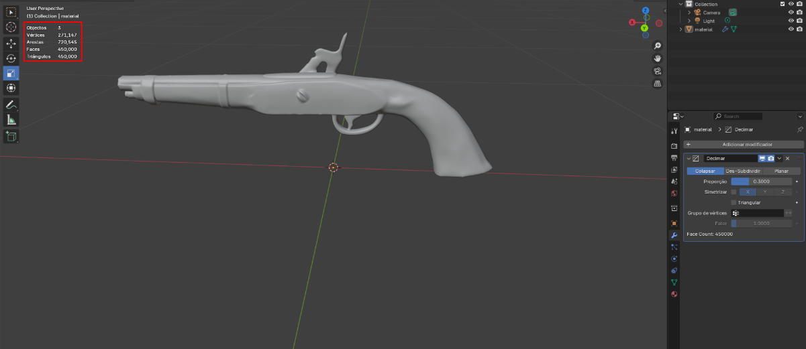

### *As faces foram de 1.500.000 para 450.000, e meu modelo continua sem alterações visíveis.*

## 4 - Exportação/Compactação

### *Clique em Ficheiro -> Exportar -> .glb*

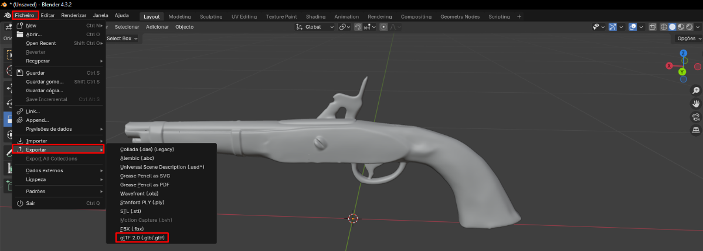

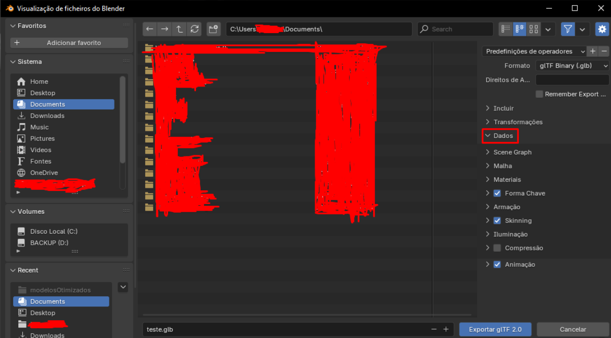

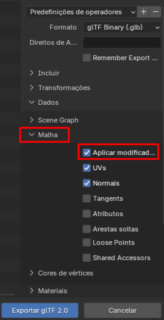

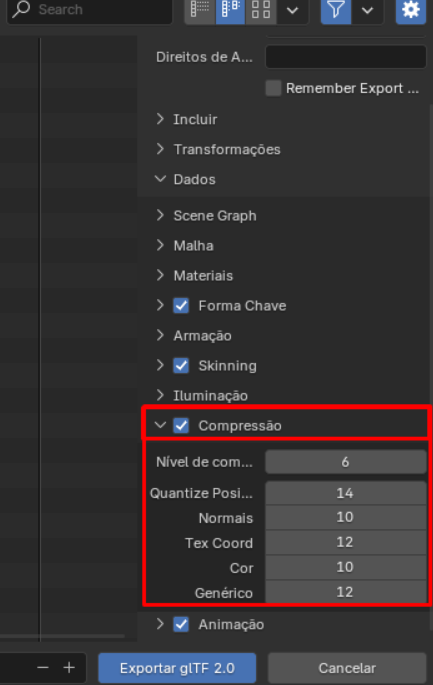

### *Importante manter esses números, logo que o nível de compressão é influenciado pelo primeiro número*

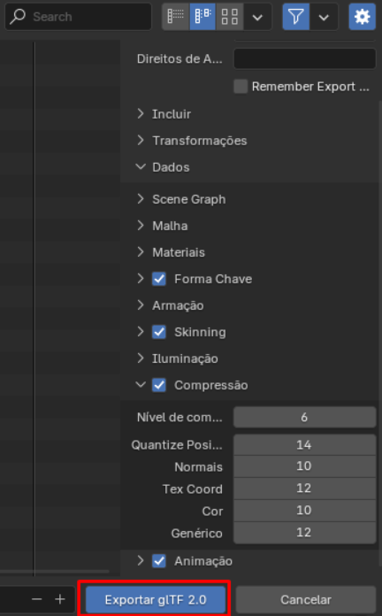

## Resultados

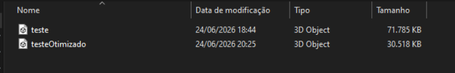

### *72 MB  ->  31 MB*
